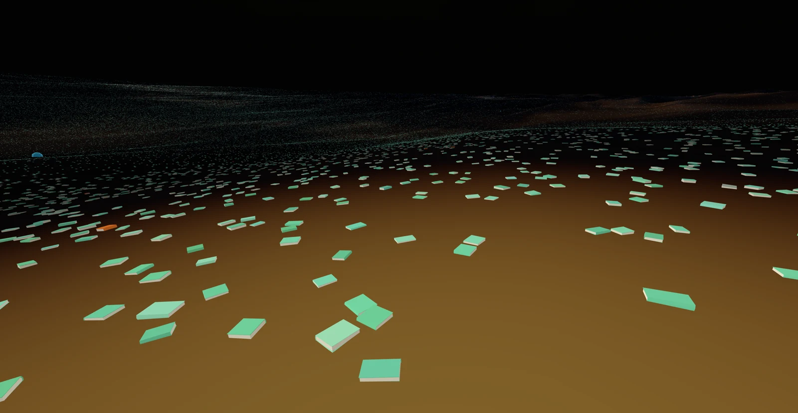
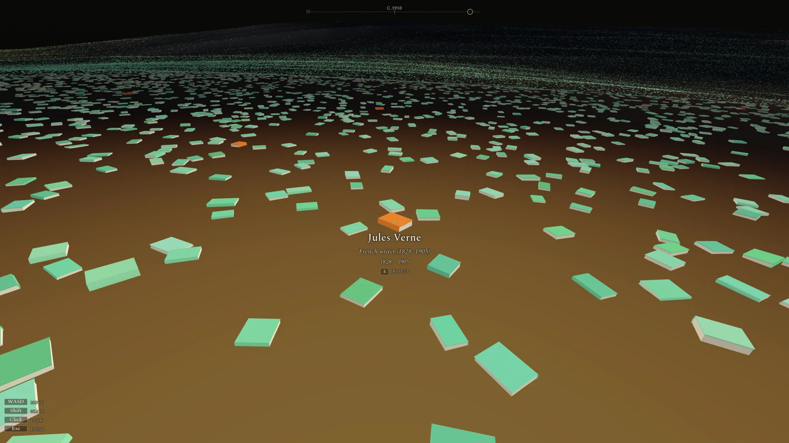
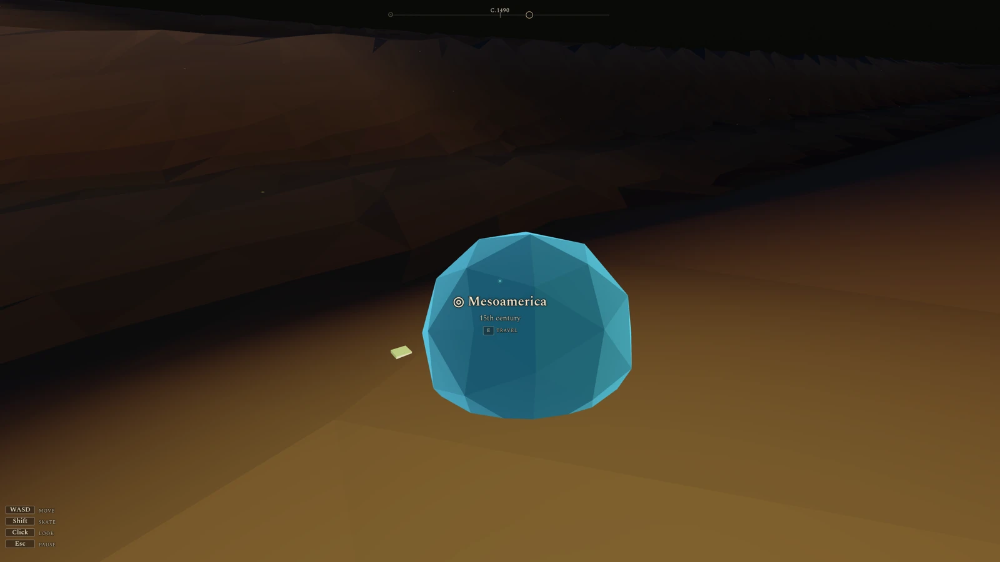

# Who Was Remembered

A browser-based 3D art piece. The player walks through a low-poly desert scattered with books, one per Wikipedia article about a historical figure. Starting at year 2000 in the centre, walking outward moves back in time, with book density thinning as recorded history grows sparser. Wikipedia's recency bias is the explicit subject, not a flaw to be corrected.



*Walking outward from the dense recent past, the books thin as recorded history grows sparser.*

<table>
<tr>
<td width="50%"><br><em>Look at any book to read who it remembers — here, Jules Verne.</em></td>
<td width="50%"><br><em>Teleporters fast-travel between 26 hand-curated anchors — here, Mesoamerica.</em></td>
</tr>
</table>

The repository has two halves: a Python preprocessing **pipeline** that turns Wikidata and Wikipedia dumps into the world (book positions, teleporter network, baked terrain), and a Three.js **runtime** (`runtime/`) that loads those artifacts and renders the walkable scene. The pipeline is run offline by the author; players only ever touch the runtime's shipped output.

## Status

Playable end-to-end on desktop and mobile. The pipeline (Stages 1–9 below) runs on the 2026-05 dumps and bakes the full corpus — about 576k books — plus the 26-monument teleporter network and the terrain heightmap. The runtime is a complete first-person walker over that whole field: grounded movement (WASD / mouse look, hold Shift to skate across the empty rings), instanced books on baked low-poly terrain under a day–night atmosphere, teleporter fast-travel, look-to-inspect labels with a Wikipedia link and a bookmark toggle, and a bookmark compass anchored on the present (inward) and the deep past (outward). Touch controls cover mobile, with a far-field density setting for performance. The screenshots above are the finished piece; the rest of this README documents the pipeline and runtime that produce it.

## Setup

Python 3.11+, [uv](https://docs.astral.sh/uv/), `lbzip2` for parallel bz2 decompression, `aria2` for the dump downloads, and the Python development headers for `mwparserfromhell`'s C tokenizer.

On Fedora-like systems:

```sh
sudo dnf install lbzip2 python3-devel aria2
uv sync
```

## Pipeline

Each stage consumes the previous stage's output from `pipeline/cache/` and writes its own. Dumps go into `pipeline/data/`. Both directories are git-ignored.

### Stage 1: Wikidata filter

`pipeline/stage1_filter_wikidata.py` streams `latest-all.json.bz2` (Wikidata, ~95 GB compressed) and writes `wikidata_figures.parquet` (about 914k rows). For each entity that is `instance of: human` with a date of death and an English Wikipedia sitelink, it captures gender, citizenships, places of birth and death, occupations, the full P31 list, and stub-detection signals.

Download (3 connections is Wikimedia's per-IP cap; more just earns 429s):

```sh
aria2c -x 3 -s 3 -k 50M -c -d pipeline/data \
  -o latest-all.json.bz2 \
  https://dumps.wikimedia.org/wikidatawiki/entities/latest-all.json.bz2
```

Run (about 2.5 hours on 8 cores):

```sh
uv run pipeline/stage1_filter_wikidata.py
```

### Stage 2: Recency and stub pre-filter

`pipeline/stage2_prefilter.py` reads `wikidata_figures.parquet` and writes `wikidata_figures_prefiltered.parquet` (about 638k rows). It drops post-2000 figures (year 2000 is the player spawn point, and contested contemporary politics concentrate there) and the clearest Wikidata stubs (no description). No download needed.

Run (under a second):

```sh
uv run pipeline/stage2_prefilter.py
```

### Stage 3: Wikipedia article extraction

`pipeline/stage3_extract_articles.py` reads `enwiki-latest-pages-articles-multistream.xml.bz2` (about 24 GB compressed) plus the Stage 2 parquet, and writes `wikidata_figures_with_articles.parquet`. It streams the dump, parses each figure's article with mwparserfromhell, and captures the lead text, the `{{short description}}` template, outgoing wikilinks (resolved through redirects and restricted to QIDs that are themselves figures), and whole-article length metrics (`article_word_count` plus section and ref counts) that Stage 4's stub cut runs on.

Download:

```sh
aria2c -x 3 -s 3 -k 50M -c -d pipeline/data \
  -o enwiki-latest-pages-articles-multistream.xml.bz2 \
  https://dumps.wikimedia.org/enwiki/latest/enwiki-latest-pages-articles-multistream.xml.bz2
```

Run (about 20 minutes):

```sh
uv run pipeline/stage3_extract_articles.py
```

### Stage 4: Article quality cut

`pipeline/stage4_quality_cut.py` reads `wikidata_figures_with_articles.parquet` and writes `wikidata_figures_quality.parquet` (about 576k rows). The criterion is article substance, not fame and not the lead's prose style: a row survives when its Wikipedia article body has at least 100 words (`article_word_count` from Stage 3). The floor is deliberately low, a stub gate rather than a notability bar, since the corpus's 25th percentile sits near 200 article words. This replaces an earlier rule that gated on lead shape (two sentences, 30 words); lead shape measured the opener's style, not whether an article exists, and so cut substantive figures whose lead happens to be a single dense sentence. The lead is still cleaned of leftover `__NOTOC__`-style magic words and kept as a display column. No download needed.

Run (under a minute):

```sh
uv run pipeline/stage4_quality_cut.py
```

### Stage 5: Place extraction

`pipeline/stage5_extract_places.py` reads the Stage 4 parquet, collects every birth and death place QID, and resolves their coordinates and country from Wikidata, writing `places.parquet` (qid, label, lat, lon, instance_of, admin parent, country). This is the geographic lookup Stage 6 needs to turn a birthplace into an angle.

### Stage 6: Placement

`pipeline/stage6_place.py` reads the Stage 4 figures plus `places.parquet` and writes `placement.parquet`, adding polar coordinates (radius, angle), their Cartesian projection (x, y), and a `landmark_tier`. Radius is era only, and linear in it: `R_INNER + (R_MAX - R_INNER) * t` where `t = (2000 - death_year) / 2800`, so every century gets equal radial width. Density is ~100x higher in modern centuries than antiquity, so this deliberately leaves the ancient rings near-empty (the emptiness is the recorded-history gap the piece is about) and pays the price at the centre, where the modern crowd is too dense to spread. The scale is derived, not picked: `R_INNER = 200`, `R_MAX ~ 7100` units is the smallest world where the bulk modern band (~1850 on) clears a roughly one-second walk between books (~1.4 units to the metre). The player spawns at the pad rim inside an overlapping thicket of the recently-dead that thins as they walk back; deep time is far out, a void meant to be skated across (hold Shift to coast the empty rings) rather than strolled. Angle is the figure's raw geographic longitude, mapped straight onto the disc (`((lon + 180) / 360) * 2*pi`). Geography stays literally true and the corpus's Western skew shows up as honest density: the Anglo-American and European longitude bands become an over-full wedge of books while the rest of the world stays sparse even in the modern ring, which is the bias the piece is about rather than something to smooth away. An earlier population-CDF version was reversed because it only relocated that bias, allocating angular width by Wikipedia attention (the USA alone took ~110 degrees of the disc) and crushing the mostly non-Western ancient world into a thin sliver. Angular placement is deliberately loose: a heavy radius-aware jitter dissolves the per-city radial spokes into organic clumps, spreading the dense modern core wide while keeping antiquity's geography crisp. About 74% of figures are anchored by a real birth/death coordinate. The rest fall through a ladder that reads only recorded data: P27 citizenship, then a hand-curated gazetteer over the English description (`gazetteer.json`). A resolved country does not become a centroid; the figure borrows a longitude sampled from an anchored compatriot, so it spreads across that country's real arc, lifting coverage to about 96%. The remaining 4% are genuinely place-less in the record and keep the deterministic per-QID random angle, with `geo_source` left null so the runtime can render them adrift rather than confidently placed. Prominence never enters position.

`landmark_tier` (major / minor / ordinary) is the notability axis, kept separate from position and meant only as a player navigation aid: a landmark is a figure the player is likelier to recognize, so a taller book gives a reference point to steer by. It has two sources. The global source is an absolute `sitelink_count` floor (cross-lingual coverage), which makes a recognizable figure a major wherever it sits (about 1,600 figures). The local source fills directions and eras where nobody clears the floor: the most-covered geo-anchored figure in each region-and-era grid cell with no major becomes a minor reference point even when globally obscure (Moctezuma II, the early-dynasty pharaohs). `sitelink_count` carries the continuous magnitude for the renderer to modulate book height within a tier.

`pipeline/inspect_placement.py` renders diagnostic PNGs (era, country, density, ring, landmarks) from a placement parquet, and is the tuning lens for the floor and grid before re-baking.

Run (a few seconds each):

```sh
uv run pipeline/stage5_extract_places.py
uv run pipeline/stage6_place.py
```

### Stage 7: Teleporter network

`pipeline/stage7_teleporters.py` reads `placement.parquet` and writes `teleporters.parquet` (26 rows): the fast-travel monuments the player jumps between. There is no auto-fill; the network is exactly these curated points, and the void between them is left to be wandered into. Each anchor is authored as a label plus a list of defining people (the Italian Renaissance is Leonardo, Michelangelo, Raphael, Machiavelli, Galileo, Botticelli), and the monument is placed from where Stage 6 actually landed those figures, so re-baking the placement moves the teleporters with it and nobody re-types a coordinate. Because the angle axis is longitude only, an anchor is coherent only when its people are co-located: a theme that spans the disc (World War II, with figures on opposite sides of the planet, averaging to dead space at the origin) cannot be one monument, so spread themes are split by place (Abbasid Baghdad and Moorish Iberia are separate anchors). The stage enforces this, failing the bake on any anchor whose people scatter wider than 40 degrees of longitude. Geo-less members (no birth or death place in the record, so a hashed-noise angle) are dropped from the centroid, and the monument sits on the most cross-lingually covered surviving member, a real grave and the recognizable face of the group. The output carries the label, position, the seat figure, the people and resolved member QIDs, and the era as a bare century derived from the members' median death year. Prominence only chooses which grave the monument sits on; it never moved a book.

Run (after Stage 6):

```sh
uv run pipeline/stage7_teleporters.py
```

`pipeline/plot_layout.py` renders the finished layout as a single overview PNG (`cache/plots/layout.png`): the whole corpus colored by era, with the teleporter monuments marked as numbered stars and a chronological legend. Unlike `inspect_placement.py` (the single-parquet tuning bench), it joins `placement.parquet` and `teleporters.parquet` to judge the network as a whole, whether each monument sits on populated ground and whether the anchors cover meaningful travel distance rather than clustering. The radius-to-year mapping behind its guide rings is imported from Stage 6, not duplicated.

```sh
uv run pipeline/plot_layout.py
```

### Stage 8: Topology

`pipeline/stage8_topology.py` reads `placement.parquet` and writes `layout.parquet`. Stages 6 and 7 produce truth (every book where its era and longitude put it); this stage massages that truth into something walkable without lying about it. A size-aware relaxation pushes apart only the pairs whose centres fall inside a larger book's footprint, so a small book is never wholly swallowed (edges may still overlap; the goal is an end to subsumption, not even spacing) and each book stays tethered to its placement so its era and longitude survive. The same pass clears a tight sphere around each teleporter monument. Where the field is genuinely too dense to separate within the tether (the Western modern apex) books pile to the tether and stay a crush, which is honest.

Run (after Stage 7):

```sh
uv run pipeline/stage8_topology.py
```

### Stage 9: Terrain bake

`pipeline/stage9_mesh.py` bakes the world's elevation field and writes `runtime/public/heightmap.bin`, the single source of ground height the runtime samples for both the surface it draws and the height every book and monument seats on, so nothing floats. The vertical axis carries no data (time and longitude are the horizontal axes); the relief is pure decoration — a central vantage hill to spawn on, spiral dune texture radiating outward, and broad spiral swells — run through a thermal-avalanche pass that rounds crests and fills toes, a neighbour operation a pointwise height function can't do, which is the reason terrain is baked rather than computed live.

```sh
uv run pipeline/stage9_mesh.py
```

### Runtime export

`pipeline/export_runtime.py` reads `layout.parquet` and writes the compact artifacts the runtime loads from `runtime/public/`: `positions.bin` (per-book position, landmark tier, geo-source confidence, home-region longitude, and quantized size, ~12 bytes each, ~7 MB for the full corpus); `meta.gz.bin` (per-figure label data — title, description, birth/death years — row-aligned with `positions.bin`, gzipped at rest from ~34 MB to ~13 MB and inflated client-side via `DecompressionStream`); `world.json` (world dimensions and book-scale bounds); and `teleporters.json` (the 26 monuments). Regenerate after any change to Stages 6–8.

```sh
uv run pipeline/export_runtime.py
```

## Run the game

The runtime is a Vite + Three.js app under `runtime/`. It reads the baked artifacts from `runtime/public/` (git-ignored; regenerate them with the pipeline above).

```sh
cd runtime
npm install
npm run dev      # local dev server
npm run build    # production bundle in runtime/dist
```
